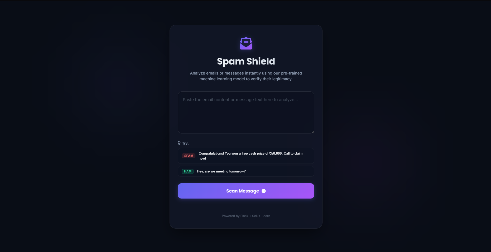

# 📧 Email Spam Classifier

An NLP-powered web application that classifies emails or messages as **Spam** or **Not Spam (Ham)** using Machine Learning and Natural Language Processing techniques. The application features a modern user interface built with Flask and provides real-time predictions.

## 🏠 Home Page



## 🌐 Live Demo

🔗 **Live Application:** https://email-spam-classifier-gold.vercel.app

## 🚀 Features

✅ Classifies messages as Spam or Not Spam
✅ Performs advanced text preprocessing and cleaning
✅ Uses TF-IDF Vectorization for feature extraction
✅ Employs Multinomial Naive Bayes for classification
✅ Interactive and responsive user interface
✅ Real-time message analysis
✅ Displays model evaluation metrics
✅ Deployed as a web application using Flask

---

## 🛠️ Tech Stack

### Machine Learning & NLP

* Python
* Scikit-Learn
* NLTK
* TF-IDF Vectorizer

### Web Development

* Flask
* HTML5
* CSS3

### Deployment

* Vercel

---

## 📂 Project Structure

```bash
Email-Spam-Classifier/
│
├── static/
│   ├── home_page.png
│   ├── confusion_matrix.png
│   ├── evaluation_score.png
│   └── style.css
│
├── templates/
│   └── index.html
│
├── app.py
├── model.pkl
├── vectorizer.pkl
├── requirements.txt
├── .gitignore
└── README.md
```
---

## 📊 Model Performance

### Confusion Matrix


### Evaluation Metrics


| Metric    | Score      |
| --------- | ---------- |
| Accuracy  | **97.09%** |
| Precision | **100%**   |

---

## 🧠 Machine Learning Workflow

1. Data Cleaning and Preprocessing
2. Text Tokenization
3. Removal of Stopwords and Punctuation
4. Stemming using Porter Stemmer
5. TF-IDF Feature Extraction
6. Model Training
7. Model Evaluation
8. Web Deployment

---

## 📊 Model Pipeline

```text
Input Message
       ↓
Text Preprocessing
       ↓
TF-IDF Vectorization
       ↓
Trained Machine Learning Model
       ↓
Spam / Not Spam Prediction
```

---

## ⚙️ Installation and Setup

### 1. Clone the Repository

```bash
git clone https://github.com/SandeepKumarSha/Email-Spam-Classifier.git
```

### 2. Navigate to the Project Directory

```bash
cd Email-Spam-Classifier
```

### 3. Create a Virtual Environment

```bash
python -m venv venv
```

### 4. Activate the Virtual Environment

#### Windows

```bash
venv\Scripts\activate
```

#### macOS/Linux

```bash
source venv/bin/activate
```

### 5. Install Dependencies

```bash
pip install -r requirements.txt
```

### 6. Run the Application

```bash
python app.py
```

The application will be available at:

```bash
http://127.0.0.1:5000
```

---

## 👨‍💻 Author

**Sandeep Kumar Sha**

* GitHub: https://github.com/SandeepKumarSha
* LinkedIn: https://www.linkedin.com/in/sandeepkumarsha

---

